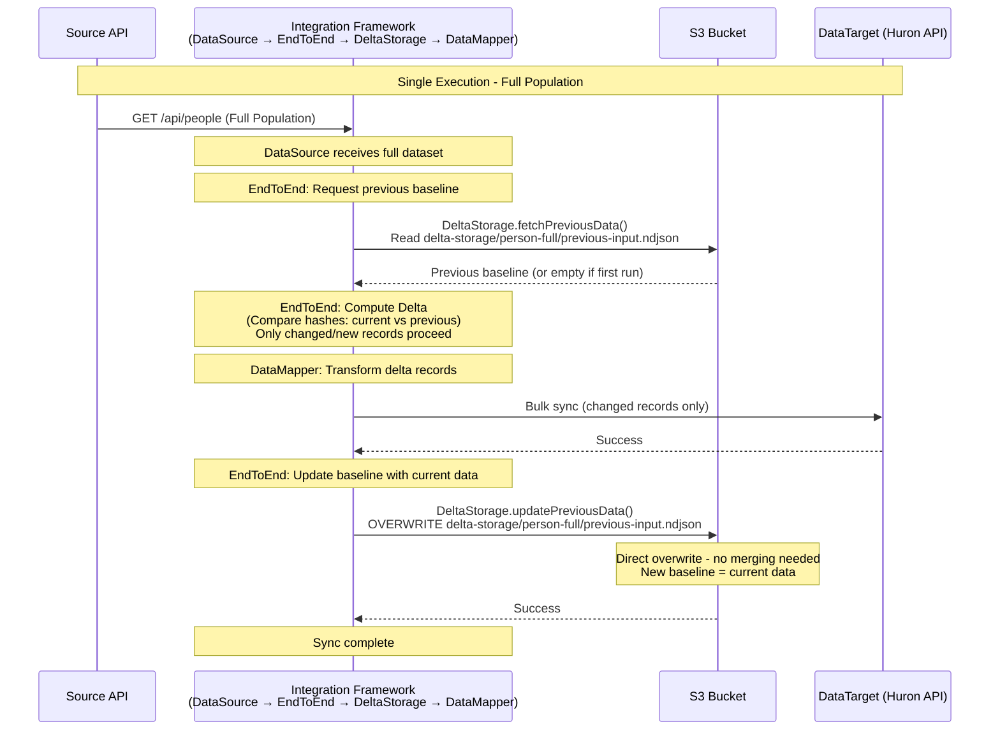
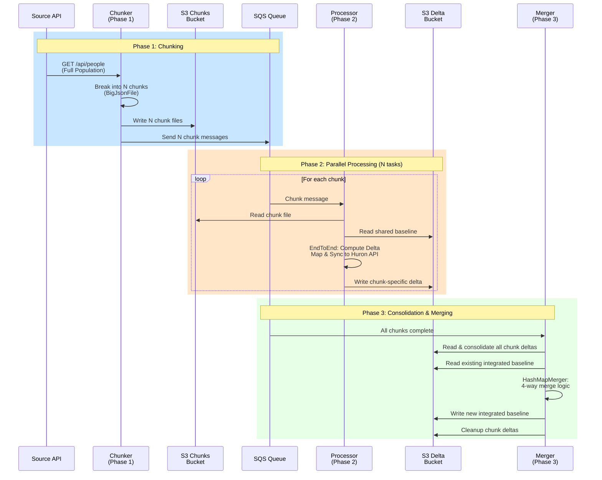
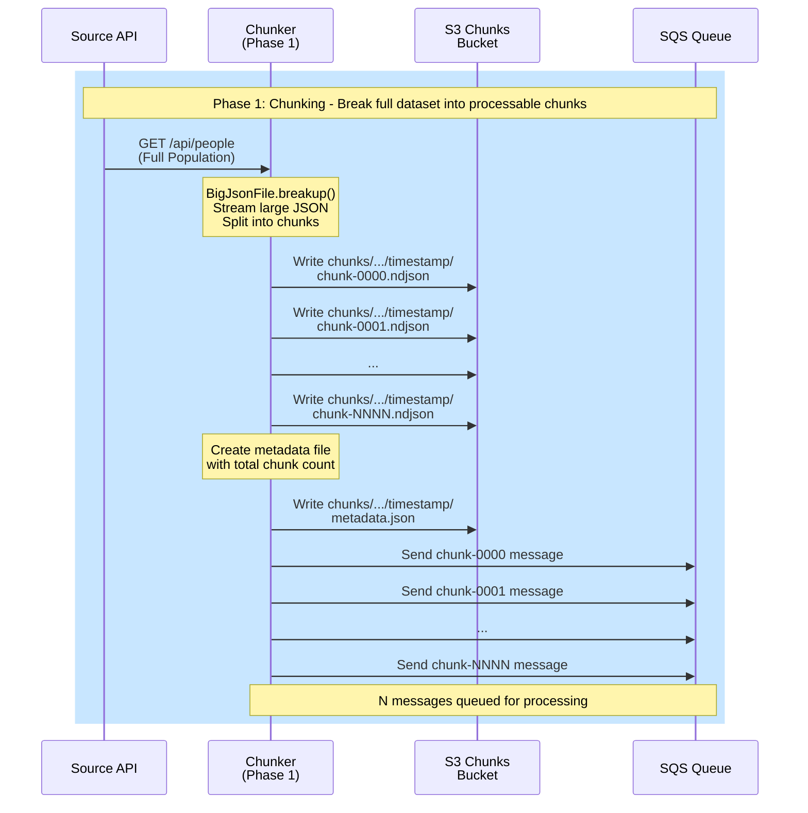
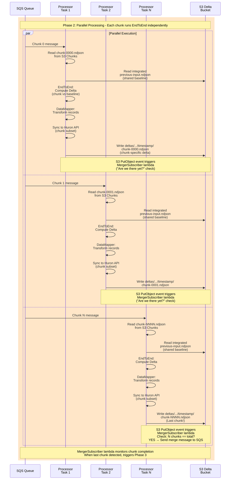
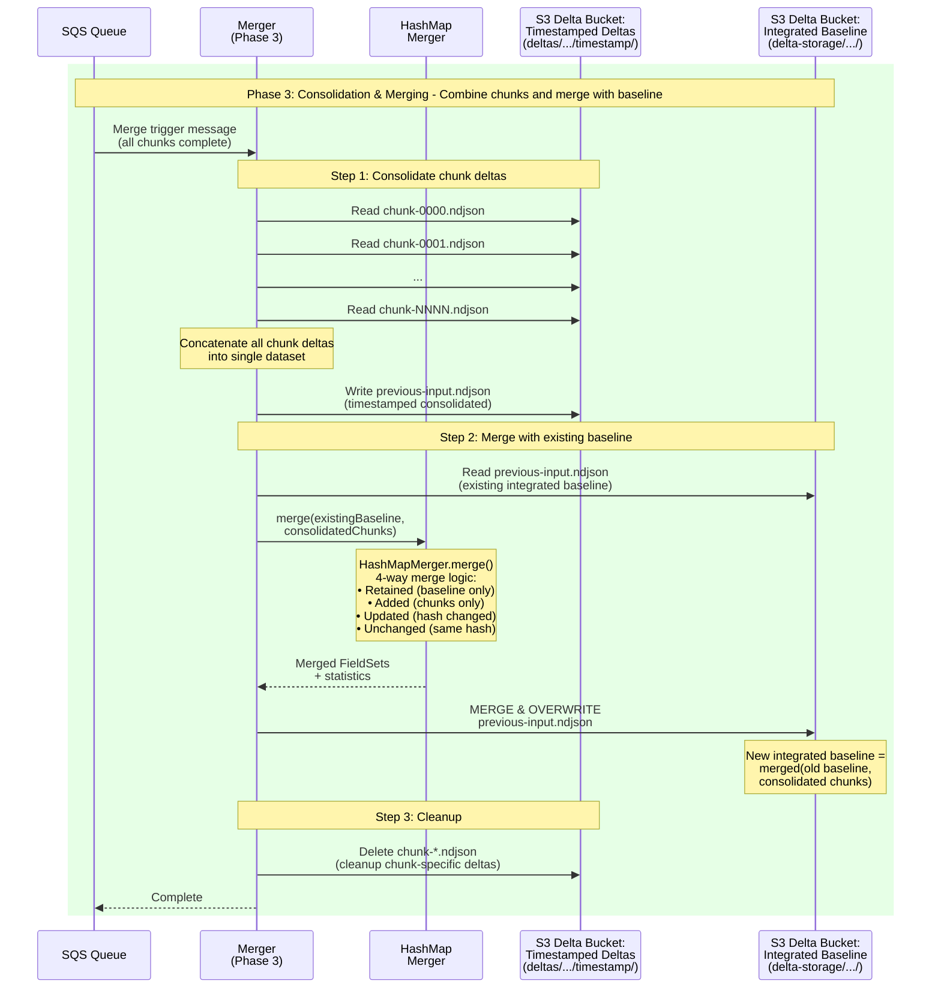

# Post-Processing Delta Storage Merging

This directory contains functionality for the post-processing delta storage merging step of the Huron Person integration, called into play only if chunked processing is used for parallel processing. This step consolidates the chunked delta outputs - each representing a subset of the overall person population - from parallel processing into a single baseline file that can then be merged with the previous baseline to comprise the final delta for the current run.

## Overview

When the chunked processing triggers the "EndToEnd" flow, that EndToEnd module "believes" it is processing a full sync and is only being called once for the entire sync operation, for the entire person population returned by original call tothe source system.
But the processing of the data source is actually scoped to just the chunk file, representing a subset of the overall person population, and the "EndToEnd" flow is called once per chunk, with each chunk having its own isolated delta storage that it reads from and writes to.

When the "EndToEnd" flow executes the DeltaStorage.updatePreviousData method, it won't be be overwriting a global previous-input.ndjson file, but instead writing to a chunk-specific, unique delta storage path derived from the chunk ID (as part of parallel processing). Thus, no prior state is ever actually being overwritten, though we let the "EndToEnd" flow maintain the illusion that it is doing so.

What this means is that the "previous-input.ndjson" files written by each chunk are actually just intermediate outputs that represent the delta state for that chunk, and not the true baseline for the entire sync operation. The true baseline is only created after all chunks have completed and their outputs are consolidated together in this post-processing merging step.

## Architecture Diagrams

The following diagrams illustrate the two operational modes of the integration: without chunking (sequential processing) and with chunking (parallel processing).

### 1. Non-Chunked Sync (Sequential Processing - No Merging Required)

### 2. Chunked Sync (Parallel Processing - Merging Required)

#### Overview Diagram 
Note: Each loop of "Phase 2" is essentially the same unchunked process depicted above, injected into a wrapper for parallel execution.

<i>(see detailed sequence diagrams below for each phase further down)</i>

#### Phase 1: Chunking (Detail)

#### Phase 2: Parallel Processing (Detail)

#### Phase 3: Consolidation & Merging (Detail)

## Key Differences

### Non-Chunked Mode
- **Single execution**: One EndToEnd run for entire population
- **No merging**: Direct overwrite of previous-input.ndjson
- **Simple delta**: Current data becomes new baseline
- **No consolidation**: Single data source, single output

### Chunked Mode
- **Parallel execution**: N EndToEnd runs (one per chunk)
- **Merging required**: HashMapMerger combines old baseline with new consolidated chunks
- **4-way merge logic**: Tracks retained, added, updated, and unchanged records
- **Two-stage delta**: 
  1. Chunk-specific deltas (intermediate, timestamped)
  2. Integrated baseline (final, shared across all syncs)
- **Consolidation phase**: Merger (Phase 3) combines all chunk outputs before merging with baseline
- **Concurrent completion detection**: MergerSubscriber lambda monitors S3 PutObject events during processing to detect when all chunks are complete
