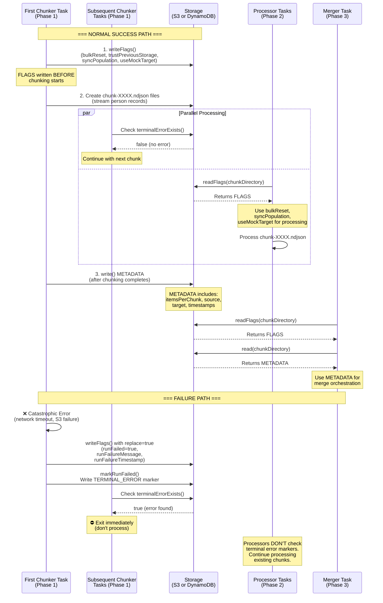

# Metadata Management Abstraction

## Purpose

Manages critical metadata types used in the 3-phase ECS Fargate chunking pipeline:

1. **FLAGS**: Early configuration flags for processors (written before chunking begins)
   - **Why Created**: Prevents race condition where processors start before chunking completes. Provides configuration context (bulkReset, trustPreviousStorage, syncPopulation) needed for processing logic.
   - **What Waits**: Processor tasks (Phase 2) read flags from the first chunk they process to determine lookup mode, validation behavior, and removal handling.
   - **Key Point**: Written IMMEDIATELY when chunker starts, BEFORE any chunks are created, ensuring processors always have configuration available.

2. **METADATA**: Run manifest and configuration for post-run diagnostics (written after chunking completes)
   - **Why Created**: Records run manifest (itemsPerChunk, source, target, chunkDirectory, sync configuration) for post-run diagnostics, monitoring, and audit trails.
   - **What Waits**: EventBridge rules poll for metadata existence to detect chunking completion and trigger Phase 3 (Merger). Merger uses metadata's createdAt timestamp to calculate full sync duration.
   - **Key Point**: Written AFTER chunking completes successfully. Processors do NOT wait for metadata—they start immediately when chunks appear (via S3 event notifications).

3. **Error Records (TERMINAL_ERROR | ERROR:{type})**: Logs catastrophic failures and individual record issues
   - **Why Created**: Tracks both pipeline-halting failures (TERMINAL_ERROR) and individual record errors (ERROR:VALIDATION, ERROR:API_CALL, ERROR:THROTTLING, ERROR:NETWORK) for diagnostics and monitoring.
   - **What Waits**: Merger checks for TERMINAL_ERROR before proceeding. If detected, merger skips the run. Non-terminal ERROR:{type} records are logged for diagnostics but don't block pipeline progression.
   - **Key Point**: TERMINAL_ERROR halts the pipeline (source fetch failure, S3 write failure). ERROR:{type} logs individual failures but allows integration to continue.

## Pipeline Flow: Metadata & Storage Interactions

The following diagram shows how FLAGS, METADATA, and TERMINAL_ERROR markers flow through the 3-phase pipeline:



**Key Observations:**

1. **FLAGS are written FIRST** (before any chunks) to prevent processor race conditions
2. **Subsequent chunker tasks** check for terminal errors before starting work
3. **Processor tasks** read FLAGS but NOT terminal error markers - they process whatever chunks exist
4. **METADATA is written LAST** (after chunking completes successfully)
5. **Merger tasks** read both FLAGS and METADATA for orchestration context
6. **Failure markers** (TERMINAL_ERROR + FLAGS update) stop subsequent chunkers but not processors

## Failure Handling Mechanism

### The Dual Marker System

When a chunking task encounters a catastrophic failure (network timeout, S3 write failure, API exhaustion), it writes **two separate markers**:

1. **FLAGS Update**: The FLAGS record is updated with failure fields:
   - `runFailed: true`
   - `runFailureMessage: string` (error description)
   - `runFailureTimestamp: string` (ISO timestamp)
   
   This is done via `writeFlags()` with `replace: true` parameter.

2. **TERMINAL_ERROR Marker**: A separate marker is written via `markRunFailed()`:
   - S3: `_terminal_error.json` file
   - DynamoDB: Record with SK="TERMINAL_ERROR"

### Why Two Markers?

- **TERMINAL_ERROR** is the primary signal for **subsequent chunker tasks** to abort early
- **FLAGS update** preserves failure context for **post-run diagnostics and auditing**
- **METADATA** may also be updated with failure fields (if written at all)

### Who Checks These Markers?

**Subsequent Chunker Tasks (Phase 1):**
- Check `terminalErrorExists()` before starting work (chunker.ts lines 363-369)
- Exit immediately with code 1 if terminal error found
- This prevents wasted processing on an already-failed run

**Processor Tasks (Phase 2):**
- **Do NOT check** `runFailed` or terminal error markers
- Continue processing whatever chunks were created before failure
- This is intentional: partial chunks may still be valuable for diagnostics

**Merger Tasks (Phase 3):**
- May check terminal error marker before merging (optional)
- Incomplete runs naturally don't trigger merger due to missing chunk markers

### When Are Failure Markers Written?

1. **Unhandled exception in chunker.ts**: Catch block writes terminal error (line 490)
2. **API retry exhaustion in ChunkFromAPI.ts**: After terminal error encountered (lines 569-577)
3. **S3 write failures**: Caught by chunker error handling

### Implementation Detail: FLAGS as Failure Record

The `Flags` type includes three optional failure fields:

```typescript
type Flags = {
  bulkReset: boolean;
  trustPreviousStorage: boolean;
  syncPopulation: SyncPopulation;
  // Failure tracking (written when markRunFailed is called)
  runFailed?: boolean;
  runFailureMessage?: string;
  runFailureTimestamp?: string;
  // Mock target configuration
  useMockTarget?: boolean;
  mockTargetValidateOnly?: boolean;
};
```

These fields are **not used by processors** during normal operation. They exist for:
- Chunker-to-chunker coordination (subsequent tasks check and abort)
- Post-run diagnostics and monitoring
- Audit trail preservation

## Template Pattern Implementation

The metadata module uses the template pattern with abstract base class and concrete implementations:

```
AbstractMetadata (abstract base)
├── MetadataForS3 (file-based implementation)
└── MetadataForDynamoDb (table-based implementation)
```

### AbstractMetadata (19 methods)

**5 Static Path Helpers**:
- `deriveDeltaStoragePath(chunkDirectory): string` - Extract delta storage path from chunk directory
- `deriveChunkDirectory(deltaStoragePath): string` - Derive chunk directory from delta storage path
- `getMetadataKey(chunkDirectory): string` - Get S3 key or DynamoDB PK for metadata
- `getFlagsKey(chunkDirectory): string` - Get S3 key or DynamoDB PK for flags
- `getTerminalErrorKey(chunkDirectory): string` - Get S3 key or DynamoDB PK for terminal error
- `extractSyncRunId(chunkDirectory): string` - Extract ISO timestamp from chunk directory for DynamoDB PK

**14 Abstract Instance Methods**:
- `write(params: WriteMetadataParams): Promise<void>` - Write metadata record
- `writeFlags(params: WriteFlagsParams): Promise<void>` - Write flags record (early in chunking)
- `read(params: ReadMetadataParams): Promise<ChunkMetadata>` - Read metadata record
- `readFlags(params: ReadFlagsParams): Promise<Flags>` - Read flags record
- `markRunFailed(params: MarkRunFailedParams): Promise<void>` - Write terminal error marker
- `isRunFailed(params: ReadFlagsParams): Promise<boolean>` - Check if run failed
- `terminalErrorExists(params: ReadTerminalErrorParams): Promise<boolean>` - Check terminal error existence
- `readTerminalError(params: ReadTerminalErrorParams): Promise<TerminalError | null>` - Read terminal error details
- `readFlagsFromChunkKey(bucketName: string, chunkS3Key: string, region?: string): Promise<Flags>` - Read flags from chunk S3 key
- `readFromChunkKey(bucketName: string, chunkS3Key: string, region?: string): Promise<ChunkMetadata>` - Read metadata from chunk S3 key
- `listChunkFiles(bucketName: string, chunkDirectory: string, region?: string): Promise<string[]>` - List all chunk files in directory
- `computeTotalRecords(bucketName: string, chunkKeys: string[], region?: string): Promise<number>` - Count total records across chunks
- `buildAggregatedMetadata(bucketName: string, chunkDirectory: string, region?: string): Promise<{chunkCount, totalRecords, chunkKeys}>` - Build aggregated metadata from chunks
- `validateMetadata(metadata: ChunkMetadata): boolean` - Validate metadata structure

## MetadataForS3 (File-Based Implementation)

### Storage Format

**Metadata File** (`_metadata.json`):
```json
{
  "itemsPerChunk": 500,
  "source": "BU CDM People API",
  "target": "Huron Target System",
  "chunkDirectory": "chunks/PersonFull/2024-01-15T10:30:00.000Z",
  "deltaStoragePath": "delta-storage/PersonFull",
  "bulkReset": false,
  "trustPreviousStorage": true,
  "syncPopulation": "PersonFull",
  "createdAt": "2024-01-15T10:30:00.000Z"
}
```

**Flags File** (`_flags.json`):
```json
{
  "bulkReset": false,
  "trustPreviousStorage": true,
  "syncPopulation": "PersonFull",
  "useMockTarget": false,
  "mockTargetValidateOnly": false
}
```

**Terminal Error File** (`_terminal_error.json`):
```json
{
  "timestamp": "2024-01-15T10:35:00.000Z",
  "errorMessage": "Failed to fetch source data",
  "errorStack": "Error: Network timeout\n  at ...",
  "phase": "chunking",
  "chunkDirectory": "chunks/PersonFull/2024-01-15T10:30:00.000Z"
}
```

### File Locations

All files stored under: `s3://{bucket}/chunks/{populationType}/{timestamp}/`

Example:
- `s3://my-bucket/chunks/PersonFull/2024-01-15T10:30:00.000Z/_metadata.json`
- `s3://my-bucket/chunks/PersonFull/2024-01-15T10:30:00.000Z/_flags.json`
- `s3://my-bucket/chunks/PersonFull/2024-01-15T10:30:00.000Z/_terminal_error.json`
- `s3://my-bucket/chunks/PersonFull/2024-01-15T10:30:00.000Z/chunk-0000.ndjson`
- `s3://my-bucket/chunks/PersonFull/2024-01-15T10:30:00.000Z/chunk-0001.ndjson`
- ...

### Implementation Details

- Uses `S3Client` for file operations (GetObject, PutObject, ListObjectsV2)
- `listChunkFiles()`: Paginates through S3 objects matching `chunk-*.ndjson` pattern
- `computeTotalRecords()`: Streams NDJSON files and counts lines (memory-efficient)
- `buildAggregatedMetadata()`: Discovers all chunks via S3 ListObjectsV2
- **Static wrapper methods**: All 13 instance methods have static wrappers for backward compatibility

### Backward Compatibility

Original code called `MetadataManager.write()` as static methods. MetadataForS3 provides static wrappers:

```typescript
// Old code (still works):
import { MetadataForS3 } from './metadata';
const MetadataManager = MetadataForS3;
await MetadataManager.write({ bucketName, chunkDirectory, ... });

// New code (instance-based):
const metadata = new MetadataForS3({ config });
await metadata.write({ bucketName, chunkDirectory, ... });
```

## MetadataForDynamoDb (Table-Based Implementation)

### Storage Format

Uses **StatisticsTable** with `eventType` field to differentiate record types:

**Metadata Record** (eventType = "METADATA"):
```
PK: "2024-01-15T10:30:00.000Z"  // syncRunId (integrationTimestamp)
SK: "METADATA"
Attributes: {
  itemsPerChunk: 500,
  source: "BU CDM People API",
  target: "Huron Target System",
  chunkDirectory: "chunks/PersonFull/2024-01-15T10:30:00.000Z",
  deltaStoragePath: "delta-storage/PersonFull",
  bulkReset: false,
  trustPreviousStorage: true,
  syncPopulation: "PersonFull",
  createdAt: "2024-01-15T10:30:00.000Z"
}
```

**Flags Record** (eventType = "FLAGS"):
```
PK: "2024-01-15T10:30:00.000Z"
SK: "FLAGS"
Attributes: {
  bulkReset: false,
  trustPreviousStorage: true,
  syncPopulation: "PersonFull",
  useMockTarget: false,
  mockTargetValidateOnly: false,
  // Optional failure tracking (present only after markRunFailed):
  runFailed: false,
  runFailureMessage: undefined,
  runFailureTimestamp: undefined
}
```

**Terminal Error Record** (eventType = "TERMINAL_ERROR"):
```
PK: "2024-01-15T10:30:00.000Z"
SK: "TERMINAL_ERROR"
Attributes: {
  timestamp: "2024-01-15T10:35:00.000Z",
  errorMessage: "Failed to fetch source data",
  errorStack: "Error: Network timeout\n  at ...",
  phase: "chunking",
  chunkDirectory: "chunks/PersonFull/2024-01-15T10:30:00.000Z"
}
```

**Non-Terminal Error Records** (eventType = "ERROR:{category}"):

Individual record failures are logged to StatisticsTable but do NOT halt the integration:

```
// Validation Error Example
PK: "2024-01-15T10:30:00.000Z"
SK: "ERROR:VALIDATION"
Attributes: {
  timestamp: "2024-01-15T10:32:15.000Z",
  personId: "U12345678",
  errorMessage: "Missing required field: email",
  chunkId: "chunk-0003",
  recordNumber: 47
}

// API Error Example
PK: "2024-01-15T10:30:00.000Z"
SK: "ERROR:API_CALL"
Attributes: {
  timestamp: "2024-01-15T10:33:20.000Z",
  personId: "U87654321",
  errorMessage: "Target API returned 500 Internal Server Error",
  statusCode: 500,
  endpoint: "/api/v2/persons/hrn123456",
  chunkId: "chunk-0005"
}

// Throttling Error Example
PK: "2024-01-15T10:30:00.000Z"
SK: "ERROR:THROTTLING"
Attributes: {
  timestamp: "2024-01-15T10:34:10.000Z",
  errorMessage: "Rate limit exceeded - 429 Too Many Requests",
  statusCode: 429,
  retryAfter: 5,
  chunkId: "chunk-0007"
}

// Network Error Example
PK: "2024-01-15T10:30:00.000Z"
SK: "ERROR:NETWORK"
Attributes: {
  timestamp: "2024-01-15T10:35:45.000Z",
  errorMessage: "Request timeout after 30000ms",
  endpoint: "/api/v2/persons/hrn999999",
  chunkId: "chunk-0010"
}
```

**Error Behavior:**
- Non-terminal errors are logged to both console and StatisticsTable
- Integration continues despite individual record failures
- Error counts accumulated in processor's errorTracker
- Processor exits with code 1 if errors occurred (but doesn't write TERMINAL_ERROR)
- Other chunks continue processing in parallel
- Only catastrophic failures write TERMINAL_ERROR and halt the pipeline

### Key Extraction

The `syncRunId` (DynamoDB PK) is extracted from the chunk directory timestamp:

```typescript
chunkDirectory: "chunks/PersonFull/2024-01-15T10:30:00.000Z"
                                    ^^^^^^^^^^^^^^^^^^^^^^^^
                                    syncRunId (ISO timestamp)
```

This is handled by `AbstractMetadata.extractSyncRunId(chunkDirectory)`.

### Implementation Details

- Uses `StatisticsTable` utility class (wraps DynamoDB Document Client)
- `write()`: Calls `StatisticsTable.writeEventRecord({ eventType: 'METADATA', ... })`
- `writeFlags()`: Calls `StatisticsTable.writeEventRecord({ eventType: 'FLAGS', ... })`
- `markRunFailed()`: Calls `StatisticsTable.writeEventRecord({ eventType: 'TERMINAL_ERROR', ... })`
- `read()`: Queries StatisticsTable with PK=syncRunId, SK="METADATA"
- `readFlags()`: Queries StatisticsTable with PK=syncRunId, SK="FLAGS"

### Not Applicable Methods

Three methods are **not applicable** in DynamoDB mode and throw errors:
- `listChunkFiles()` - Chunk files always remain in S3, not DynamoDB
- `computeTotalRecords()` - Must read NDJSON files from S3 regardless of storage mode
- `buildAggregatedMetadata()` - Requires S3 file listing

These methods are S3-specific utilities for chunk discovery and are not needed when metadata is in DynamoDB (chunk files still in S3).

## Factory Pattern

### MetadataFactory

Switches between implementations based on `config.storage.type`:

```typescript
import { MetadataFactory } from './metadata';

const metadata = MetadataFactory.create(config);
// Returns: MetadataForS3 if config.storage.type is 's3'|'file'|'database'
// Returns: MetadataForDynamoDb if config.storage.type is 'dynamodb'
```

### Consumer Pattern

Consumers (chunker.ts, processor.ts, merger.ts) use backward compatibility aliasing:

```typescript
import { MetadataForS3 } from '../src/chunking/metadata';
const MetadataManager = MetadataForS3;  // Alias for minimal code change

// Usage (still works as before):
await MetadataManager.write({ bucketName, chunkDirectory, ... });
await MetadataManager.writeFlags({ bucketName, chunkDirectory, bulkReset, ... });
const flags = await MetadataManager.readFlags({ bucketName, chunkDirectory });
```

**Migration Path**: Replace `MetadataManager` with `MetadataFactory.create(config)` to enable dynamic switching.

## Pipeline Flow

### Phase 1: Chunker (docker/chunker.ts)

1. **Write Flags Early** (before chunking begins):
   ```typescript
   await MetadataManager.writeFlags({
     bucketName, chunkDirectory,
     bulkReset, trustPreviousStorage, syncPopulation
   });
   ```
   
2. **Create Chunk Files** (`chunk-0000.ndjson`, `chunk-0001.ndjson`, ...)

3. **Write Metadata** (after chunking completes):
   ```typescript
   await MetadataManager.write({
     bucketName, chunkDirectory, itemsPerChunk,
     source, target, bulkReset, trustPreviousStorage, syncPopulation
   });
   ```

4. **On Failure** (catastrophic error):
   ```typescript
   await MetadataManager.markRunFailed({
     bucketName, chunkDirectory,
     runFailureMessage: error.message,
     runFailureTimestamp: new Date().toISOString()
   });
   ```

### Phase 2: Processor (docker/processor.ts)

1. **Read Flags** (for sync configuration):
   ```typescript
   const flags = await MetadataManager.readFlagsFromChunkKey(
     bucketName, chunkS3Key, region
   );
   // Use flags.bulkReset, flags.syncPopulation in processing logic
   ```

2. **Process Chunk** (apply data mapping, delta logic)

3. **Write Results** (to S3 or DynamoDB depending on storage mode)

### Phase 3: Merger (docker/merger.ts)

1. **Read Metadata** (to get run context):
   ```typescript
   const metadata = await MetadataManager.read({
     bucketName, chunkDirectory
   });
   ```

2. **Read Flags** (for bulkReset behavior):
   ```typescript
   const flags = await MetadataManager.readFlags({
     bucketName, chunkDirectory
   });
   ```

3. **Check Terminal Error** (before proceeding):
   ```typescript
   const hasFailed = await MetadataManager.terminalErrorExists({
     bucketName, chunkDirectory
   });
   if (hasFailed) {
     const error = await MetadataManager.readTerminalError({
       bucketName, chunkDirectory
     });
     // Handle failure scenario
   }
   ```

4. **Merge Results** (consolidate processing output)

## Testing

### Running Metadata Tests

```bash
# Run all metadata tests
npm test -- Metadata.test.ts

# Run specific test
npm test -- Metadata.test.ts -t "should write and read metadata"
```

### Test Coverage

- Metadata write/read operations
- Flags write/read operations
- Terminal error marking and detection
- Chunk file listing and record counting
- Aggregated metadata building
- Error handling (missing files, invalid JSON)

## Common Issues

### "Metadata file not found"

**Cause**: Processor tasks reading flags before chunker has written them.

**Solution**: Chunker writes flags **immediately** (before chunking begins) to avoid this race condition.

### "Cannot read property 'bulkReset' of undefined"

**Cause**: Flags structure mismatch or corrupted JSON.

**Solution**: Validate flags structure with `AbstractMetadata.validateFlags()` (if implemented).

### "chunkDirectory required but not provided"

**Cause**: Missing `chunkDirectory` parameter in read operations.

**Solution**: Ensure all read operations pass `chunkDirectory` from chunk S3 key or environment variable.

## Future Enhancements

1. **Validation Methods**: Add `validateMetadata()` and `validateFlags()` implementations
2. **Retry Logic**: Add exponential backoff for DynamoDB throttling
3. **Caching**: Cache frequently-read flags in memory (processor optimization)
4. **Compression**: Compress large metadata payloads (S3 mode)
5. **Versioning**: Support metadata schema versioning for backward compatibility
