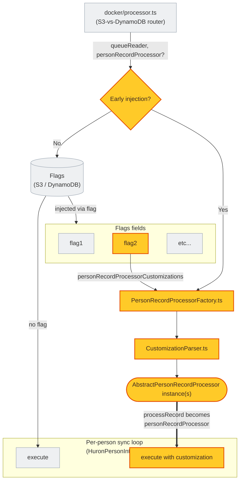
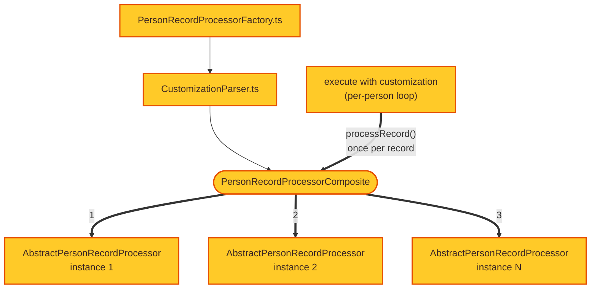
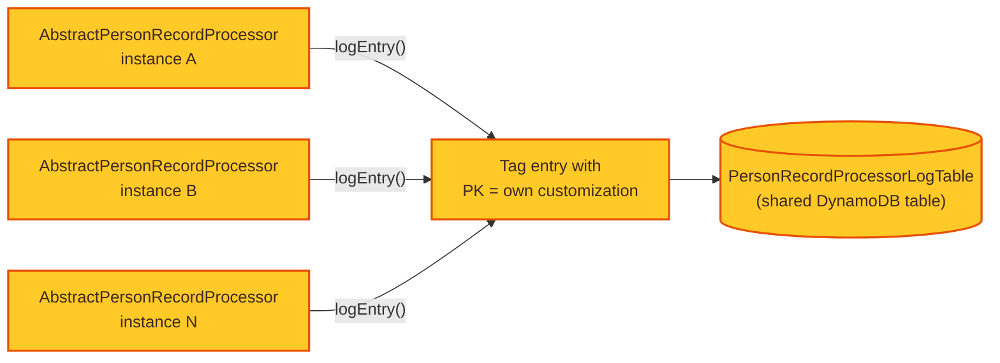

# Person Record Processor Customizations

This directory implements a small framework that lets custom, per-person async logic run
during the processor phase of a Huron person sync as addon functionality - without modifying `HuronPersonIntegration` or `DataMapper` in
`integration-huron-person`. It exists to make **implementations pluggable**: any number of
custom "customizations" can be written here, selected at runtime, and combined, all without
touching the core sync/mapping code.

## Files

| File | Role |
| --- | --- |
| `AbstractCustomPersonProcessor.ts` | `Customization` enum + `AbstractPersonRecordProcessor` base class that every customization extends. |
| `CustomizationParser.ts` | Parses the comma-delimited configuration string into `Customization` values. |
| `PersonRecordProcessorComposite.ts` | Combines several active customizations into one. |
| `PersonRecordProcessorFactory.ts` | Resolves which customization(s) are active and constructs them. |
| `impl/` | Concrete customizations live here, one file per customization. |

## Use of dependency injection


<span style="display:inline-block;width:10px;height:10px;background:#eef0f2;border:1px solid #9aa5b1;"></span>&nbsp;**Standard processor phase** - Plumbing that exists regardless of this framework.&nbsp;&nbsp;&nbsp;<br><span style="display:inline-block;width:10px;height:10px;background:#ffca28;border:1px solid #e65100;"></span>&nbsp;**Dependency injection** - The machinery this directory adds to inject custom per-person logic into the sync process.




`HuronPersonIntegration` (in `integration-huron-person`) accepts an optional
`personRecordProcessor` constructor param - a plain callback matching:

```ts
type PersonRecordProcessor = (record: { raw: any, mapped?: FieldSet, error?: unknown }) => Promise<void>;
```

It is invoked once per person record encountered during a sync (success or mapping failure),
regardless of whether the sync as a whole succeeds. `HuronPersonIntegration` has no idea what
this callback does, or how many customizations it represents - it's just handed a function.

That function is assembled here and injected at the last possible moment:

1. `docker/processor.ts` (the S3-vs-DynamoDB router) accepts an optional `personRecordProcessor`
   parameter and threads it through to whichever of `ProcessorForS3.ts`/`ProcessorForDynamoDb.ts`
   it routes to.
2. If nothing was injected, each `main()` resolves it itself by reading
   `flags.personRecordProcessorCustomizations` (see the root `CLAUDE.md` for how that Flags field
   is populated) and calling `personRecordProcessorFactory(...)`.
3. The resolved `AbstractPersonRecordProcessor` instance's `processRecord` method - which
   already matches the `PersonRecordProcessor` shape - is passed straight into
   `HuronPersonIntegration`.

No customization is ever hard-coded into the processor entry points; which one(s) run is purely
a runtime decision.

## Multi-customization capability



More than one customization can be active for the same sync. `personRecordProcessorFactory`
takes a comma-delimited string (parsed by `CustomizationParser.ts`), constructs one instance per
valid, de-duplicated customization, and:

- returns `undefined` if none resolved (no-op),
- returns that single instance if exactly one resolved,
- otherwise wraps all of them in a `PersonRecordProcessorComposite`.

Each token in the comma-delimited string may be either a `Customization` enum **key name** (e.g.
`'ORG_COMPARISON_LOGGING'`) or its underlying numeric value as a string (e.g. `'0'`) - both are
accepted so configuration isn't forced to track the enum's internal numbers, while still
allowing a numeric value if that's more convenient for a given caller. Specifying the same
customization twice (whether by name, by number, or one of each) only produces one instance.

`PersonRecordProcessorComposite` is itself an `AbstractPersonRecordProcessor` - it just holds an
array of other instances and, for every record, calls each wrapped instance's `processRecord` in
turn. One customization throwing does not prevent the others from running (the error is caught
and logged). This mirrors the wrapping style used by `src/runner/decorators/` (hold an inner
instance, delegate to it) - composing several instances rather than decorating exactly one.

## Shared log table



Customizations that want to persist findings call the inherited
`this.logEntry(this.customization, personid, data)` helper, which writes to a single shared
DynamoDB table (see the root `CLAUDE.md`'s "Shared log table" section). `data` is a free-form
JSON blob - its shape is entirely up to each customization.

## How to add a new implementation

1. Add a new value to the `Customization` enum in `AbstractCustomPersonProcessor.ts`.
2. Create a new file under `impl/` with a class extending `AbstractPersonRecordProcessor`:
   - set `readonly customization` to your new enum value,
   - implement `processRecord: PersonRecordProcessor = async ({ raw, mapped, error }) => { ... }`,
   - call `this.logEntry(this.customization, personid, data)` to persist any findings.
3. Register the new class in the `switch` in `PersonRecordProcessorFactory.ts`.
4. Activate it by setting `PERSON_RECORD_PROCESSOR_CUSTOMIZATIONS` to the enum *key* (see the
   root `CLAUDE.md` for where this value is sourced from at runtime) - comma-delimit multiple
   keys to run several customizations together.
