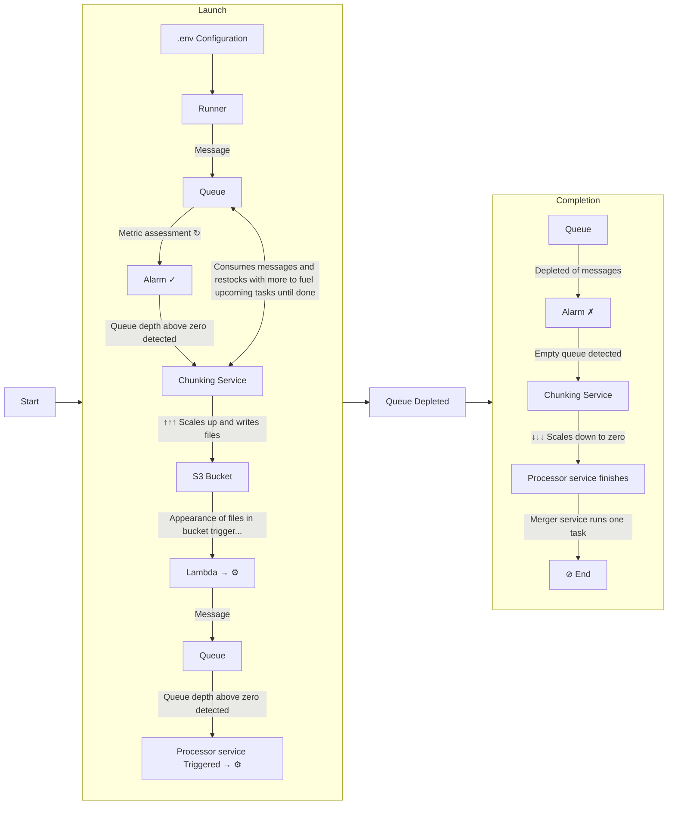

# Integration Runner

## Overview

The integration runner is used to "kick off" an integration run. It can be configured to do so in multiple ways/modes. 

Most modes assume parallel processing.
The fundamental flow common to all modes in parallel processing is depicted below:

## Modes of Operation (TODO: Complete these...)

### No concurrency

### Single person mode (testing)

### Concurrency mode

### Concurrency mode with queue seeding

### Source Simulator decorator mode